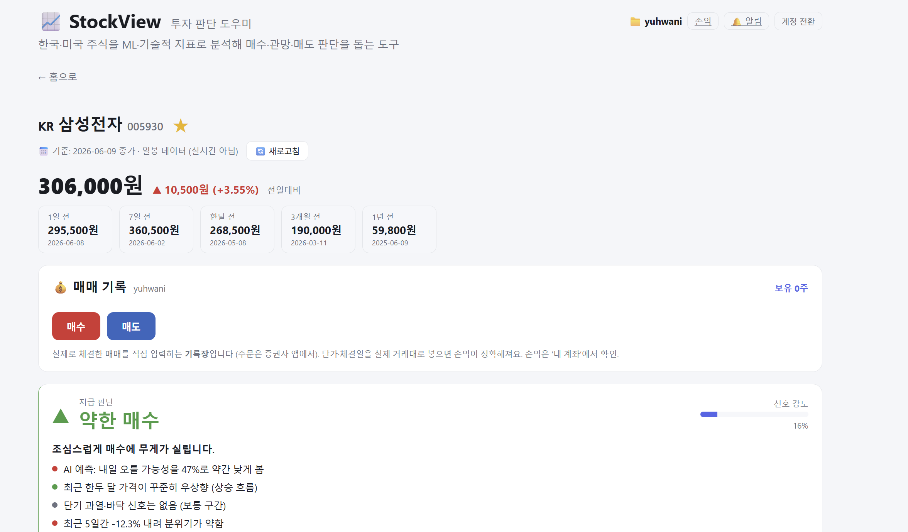
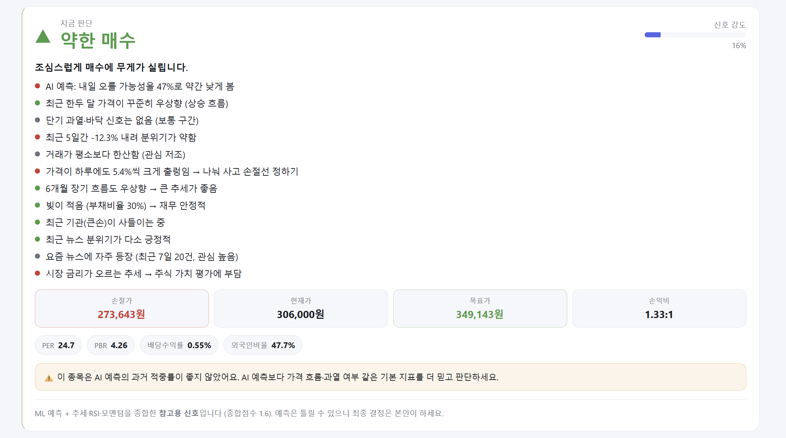
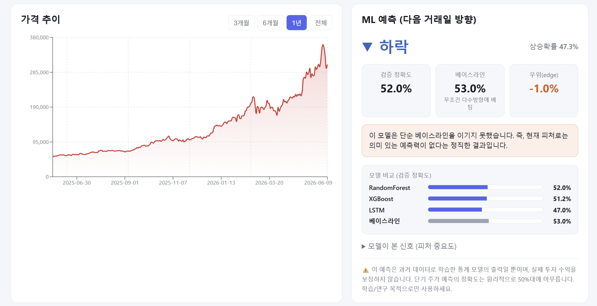
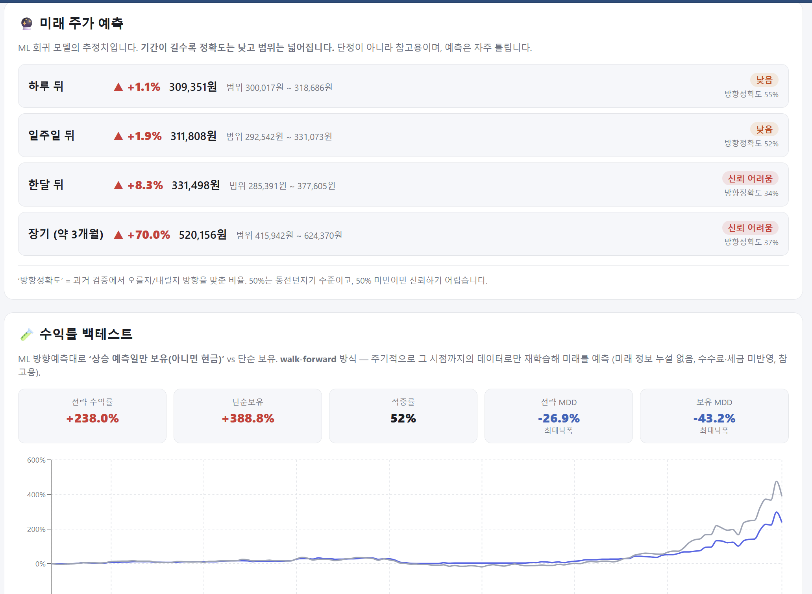
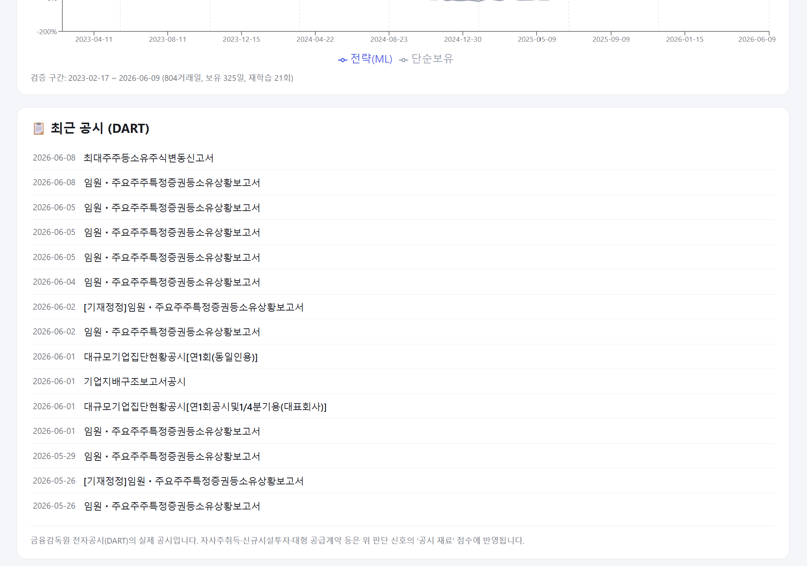
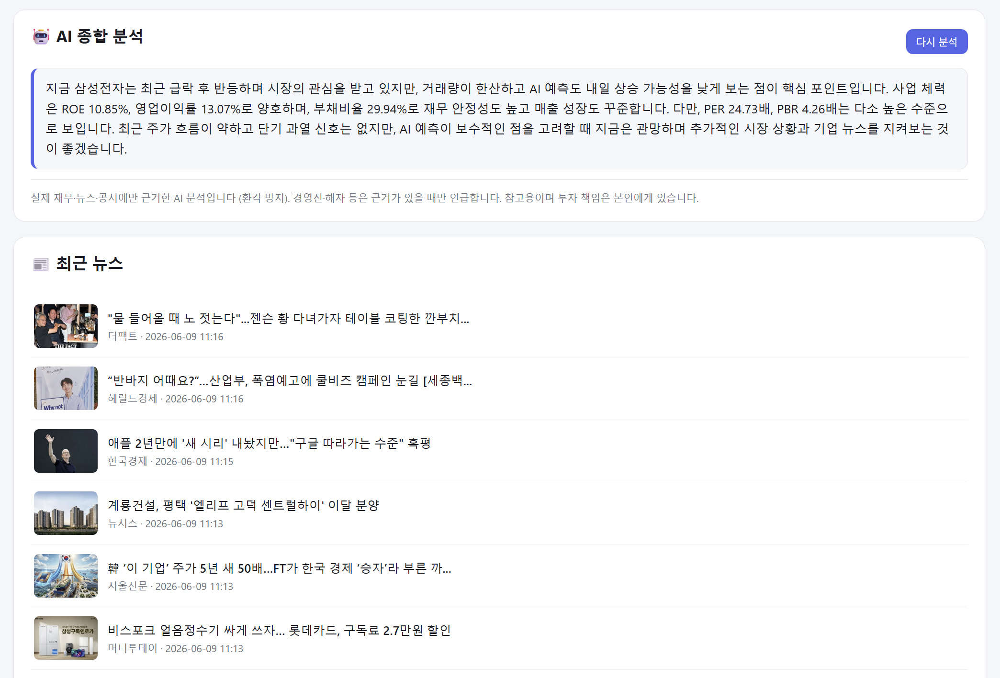

# 📈 StockView

> 한국·미국 주식을 **머신러닝 · 기술적 지표 · 실시간 이벤트**로 분석해
> **"지금 살까, 아니면 뺄까"** 판단을 돕는 풀스택 투자 보조 웹앱.

종목을 검색하면 가격 차트, ML 상승/하락 예측, 20여 개 근거를 종합한 **매수·관망·매도 신호**,
무료 AI(Gemini)의 종합 분석을 보여주고 — 관심 종목에 **재료가 뜨면 텔레그램으로 실시간 알림**까지 보냅니다.

```
React (Vite) ──┐
               ├── REST ── FastAPI ──┬── ML (RF · XGBoost · LSTM, 확률보정·앙상블)
Recharts ──────┘                     ├── 데이터 (FDR · 네이버 · DART · stockanalysis · NASDAQ)
                                     ├── AI 분석 (Google Gemini)
   텔레그램 봇  ◀── 백그라운드 워커 ◀──┴── 실시간 이벤트 감지 (3분 주기)
```

> ⚠️ **면책**: 주가는 100% 맞출 수 없습니다(특히 단기). 이 도구의 신호는 **참고용**이며 틀릴 수 있고,
> 최종 투자 판단과 책임은 본인에게 있습니다. 그래서 과신을 막기 위해 — 신호와 함께 **모델이 과거에
> 실제로 얼마나 맞췄는지(정확도·베이스라인 대비 우위)** 를 항상 같이 보여줍니다.
> ([정직한 검증](#-정직한-검증-차별점) 참고)



---

## ✨ 주요 기능

- 🔍 **종목 검색·목록** — 한국(KOSPI/KOSDAQ) + 미국(NASDAQ/NYSE). 시총·거래대금·상승률·S&P500 등 큐레이션 목록.
- 📊 **매수/관망/매도 신호** — 20여 개 근거를 점수화한 **투명한 판단**. 모든 근거를 화면에 그대로 공개.
- 🤖 **AI 종합 분석** — 무료 Gemini가 재무·뉴스·공시·섹터를 읽고 사업 체력·경쟁력까지 서술 평가.
  (제공된 근거에만 기반 → 환각 방지)
- 🔔 **실시간 텔레그램 알림** — 관심·보유 종목의 급등락·공시·뉴스를 3분 주기로 감지해 즉시 발송.
  **매수 신호 위주** 필터, 관심목록 밖 **급등 종목 발굴**, 같은 종목 하루 1회(강한 후속은 예외).
- 🔥 **오늘의 추천** — 매일 장 마감 후 전 종목을 스캔해 순위화, **1등을 매일 텔레그램**으로.
- 📈 **다기간 예측 + 백테스트** — RF/XGBoost/LSTM 비교, walk-forward 검증, 확률 보정, 수익률 백테스트.
- 💼 **매매 기록·손익** — 계정별 포트폴리오(평가·실현·총손익).
- 🧪 **정직한 검증** — 각 근거의 실제 예측력을 데이터로 측정해 **과신을 경계**.

---

## 📸 스크린샷

<table>
<tr>
<td width="50%"><br/><sub><b>투명한 판단</b> — 20여 개 근거를 점수화하고 모두 공개 (PER·수급·목표가·손익비까지)</sub></td>
<td width="50%"><br/><sub><b>ML 예측 &amp; 모델 비교</b> — RandomForest·XGBoost·LSTM·베이스라인을 같은 분할에서 비교</sub></td>
</tr>
<tr>
<td width="50%"><br/><sub><b>다기간 예측 + 수익률 백테스트</b> — 전략 vs 단순보유, 최대낙폭(MDD)까지</sub></td>
<td width="50%"><br/><sub><b>DART 전자공시 연동</b> — 실제 공시를 판단 신호의 재료로</sub></td>
</tr>
<tr>
<td colspan="2"><br/><sub><b>AI 종합 분석 (무료 Gemini)</b> — 재무·뉴스·공시를 종합한 서술 평가 + 최근 뉴스 (제공 근거에만 기반 → 환각 방지)</sub></td>
</tr>
</table>

---

## 🛠 기술 스택

| 영역 | 사용 |
|------|------|
| **Frontend** | React 18, Vite, React Router, Recharts |
| **Backend** | Python, FastAPI, scikit-learn, XGBoost, PyTorch(LSTM), pandas |
| **데이터** | FinanceDataReader, 네이버 증권, DART 전자공시, stockanalysis.com, NASDAQ 스크리너 |
| **자동화·AI** | Telegram Bot API, Google Gemini, Windows 작업 스케줄러(백그라운드 워커) |

엔지니어링 포인트: **다중 소스 데이터 파이프라인**(소스 장애 시 네이버 백업·디스크 캐시로 무중단),
**실시간 이벤트 자동화**(로그인 시 자동 시작되는 백그라운드 워커), **ML 신뢰성**(확률 보정·앙상블·시간순 검증),
그리고 **결과를 과대포장하지 않는 정직한 검증**.

---

## 🏗 구조

```
StockView/
├── backend/                # Python + FastAPI
│   ├── data.py             # 데이터 수집 (한국+미국, 네이버 백업·캐시)
│   ├── features.py         # 기술적 지표 → ML 피처
│   ├── model.py            # RF/XGB/LSTM 학습·예측·백테스트·신호 점수화
│   ├── fundamentals.py     # 재무·수급·밸류에이션 (네이버 / stockanalysis)
│   ├── dart.py             # DART 전자공시 연동
│   ├── ai.py               # Gemini 종합 분석 (근거 기반, 환각 방지)
│   ├── watcher.py          # 실시간 이벤트 감지 → 텔레그램 알림 워커
│   ├── recommend.py        # 오늘의 추천 배치
│   ├── factor_backtest.py  # 근거별 예측력(IC) 측정
│   ├── factor_learn.py     # 로지스틱 가중치 학습·검증
│   └── main.py             # API 엔드포인트
└── frontend/               # React (Vite) + Recharts
    └── src/{pages, components}/
```

| 엔드포인트 | 설명 |
|-----------|------|
| `GET /api/search?q=삼성` | 종목명/코드 검색 (한국+미국) |
| `GET /api/stock/{code}`  | 일봉 OHLCV 시세 (차트용) |
| `GET /api/predict/{code}`| ML 예측 + 종합 신호 + 백테스트 평가 |
| `GET /api/ai-summary/{code}` | AI 종합 분석 |
| `GET /api/recommendations` | 오늘의 추천 |
| `GET /api/list/{id}` | 목록별 종목 (`krx_cap100`, `us_cap100`, `krx_gainers` …) |
| `GET·POST /api/alert-config` | 알림 설정 조회·갱신 |

---

## 🧠 판단 시스템

여러 신호에 **점수를 매겨 합산**하고, 합계로 행동을 정합니다. **모든 근거는 화면에 그대로 표시**됩니다.

- **기술적**: ML 상승확률 · 추세(20·60·120일선) · RSI · 모멘텀 · 거래량 · 52주 위치 · 변동성 · MACD · 지지/저항
- **펀더멘털**: PER/PBR · ROE · 영업이익률 · 부채비율 · 매출성장 · 애널리스트 의견
- **수급·심리**: 외국인·기관 순매수 · 공매도 비중 · 시장 대비 상대강도
- **재료·환경**: DART 공시 · 뉴스 감성/재료 · 언론 노출 빈도 · 공포지수(VIX) · 금리 방향

**합계 → 행동**: `≥3` 매수 우위 · `≥1` 약한 매수 · `−1~1` 관망 · `≤−1` 약한 매도 · `≤−3` 매도 우위
**신뢰도 보정**: 그 종목에서 ML이 백테스트 베이스라인을 못 이겼으면 신뢰도를 낮추고 경고 → 과신 방지.
**손절·목표가**: 변동성(ATR) 기반 자동 산출.

**ML 모델**: 과거 일봉 피처로 "다음날 상승?"을 학습(RF/XGBoost/LSTM 비교), **시간순** 검증으로
미래 정보 누설 없이 정확도·`edge`를 측정. 확률은 **보정(calibration)** 후 **RF+XGBoost 앙상블**로 산출.

---

## 🧪 정직한 검증 (차별점)

이 프로젝트의 가장 큰 특징은 **결과를 과대포장하지 않는 것**입니다.
`factor_backtest.py`(근거별 IC) + `factor_learn.py`(로지스틱 다변량 학습)로 약 9만 종목-일을
시간순 검증한 결과:

> **기술적·가격 근거만으로는 단기 방향을 사실상 못 맞춘다** — 로지스틱 검증 AUC가
> 5일 0.504 / 20일 0.520 / 60일 0.443으로 **베이스라인을 넘지 못함**(동전던지기 수준).
> 이는 코드 문제가 아니라 **효율적 시장의 본질**.

그래서 점수제를 **'예측기'가 아니라 '투명한 현황 체크리스트'** 로 명확히 규정하고,
기대수익의 원천을 ① **재료(공시·뉴스 catalyst)** ② **밸류에이션·재무(장기)**
③ **리스크 관리** ④ **투명성(근거 공개 → 사용자 판단)** 으로 재정의했습니다.
→ 더 자세한 내용·로드맵은 [ROADMAP.md](ROADMAP.md).

---

## 🚀 실행 방법

```bash
make install   # 최초 1회: 백엔드 venv + 프론트 node_modules
make           # 백엔드(:8000) + 프론트(:5173) 동시 실행 (Ctrl-C로 종료)
```

브라우저에서 **http://localhost:5173** 접속.

| 명령 | 설명 |
|------|------|
| `make` | 백엔드 + 프론트 동시 실행 |
| `make backend` / `make frontend` | 각각 실행 |
| `make watch` | 실시간 알림 워커 실행 |
| `make recommend` | 오늘의 추천 배치 실행 |
| `make install` / `make clean` | 의존성 설치 / 삭제 |

**선택 설정** (`backend/.env`, gitignore):
- `GEMINI_API_KEY` — AI 분석 (aistudio.google.com, **무료**). 없으면 키워드 기반 폴백.
- `DART_API_KEY` — 한국 전자공시.
- `TELEGRAM_BOT_TOKEN` / `TELEGRAM_CHAT_ID` — 텔레그램 알림. 없으면 콘솔 출력.

> Windows에 `make`가 없으면: `winget install ezwinports.make` 후 터미널 새로 열기.

---

## 🗺 로드맵 · 개발 노트

진행 중 작업·아이디어·검증 기록은 **[ROADMAP.md](ROADMAP.md)** 에 정리돼 있습니다.
커밋 컨벤션은 [COMMIT_CONVENTION.md](COMMIT_CONVENTION.md) 참고.
